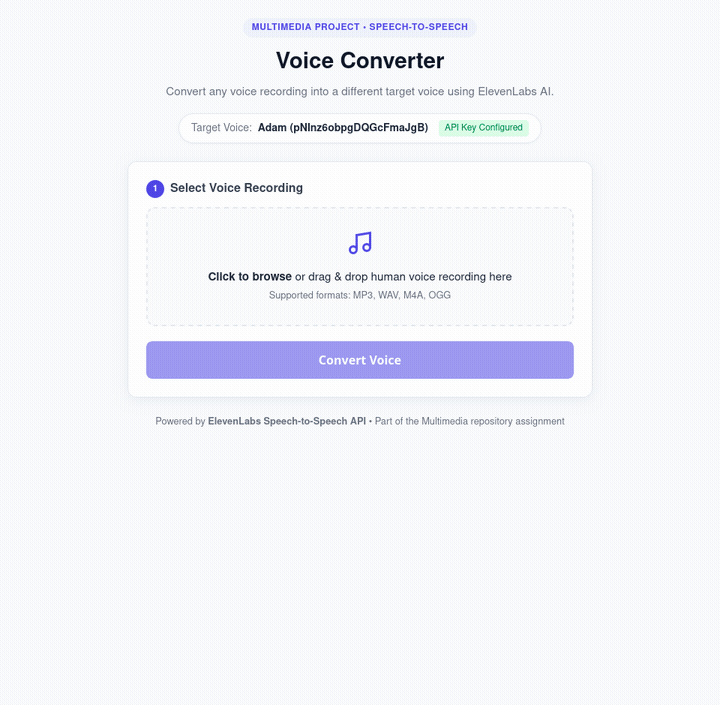

# Final Project — Multimedia Processing Suite

A consolidated multimedia laboratory suite featuring media metadata analysis, speech-to-speech conversion, AI voice cloning, and digital image enhancement.

---

## 🗂️ Project Structure

```
final-Multimedia/
├── samples/                      # Test media files (Images, Audio, Video)
│   ├── sample.jpg
│   ├── sample.mp3
│   ├── sample.mp4
│   └── speech_sample.mp3
│
├── main.py                       # [Task 1] Multimedia Metadata Analyzer CLI
├── file_utils.py
├── image_analyzer.py
├── audio_analyzer.py
├── video_analyzer.py
├── report_generator.py
│
├── voice-converter/              # [Task 2] ElevenLabs Speech-to-Speech Voice Converter
│   ├── server.js                 # Node.js/Express STS backend
│   ├── package.json
│   ├── README.md
│   └── public/                   # Web interface
│
├── voice-cloning/                # [Task 3] AI Voice Cloning & TTS Engine
│   ├── server.js                 # Express Voice Cloning & Neural TTS backend
│   ├── clone_voice.py            # Python CLI for voice cloning
│   ├── package.json
│   ├── README.md
│   └── public/                   # Voice Cloning Web Studio
│
└── image-enhancer/               # [Task 4] Digital Image Enhancement Studio
    ├── enhancer.py               # Core image processing engine (Pillow + NumPy)
    ├── cli.py                    # Python CLI with PSNR/MSE metrics
    ├── server.py                 # Lightweight local web server
    ├── README.md
    └── web/                      # Interactive Split-Slider Web Studio
```

---

## 📌 Task 1: Consolidated Multimedia Metadata Analyzer

Accepts any media file (Image, Audio, Video), auto-detects the container and codec types, routes to the appropriate analyzer module, and generates a structured JSON report.

### Usage
```bash
python main.py samples/sample.jpg
python main.py samples/sample.mp3
python main.py samples/sample.mp4
```

### Sample Report
```json
{
    "File Type Identified": "VIDEO",
    "File Name": "sample.mp4",
    "File Size": "0.75 MB",
    "Container": "QuickTime / MOV",
    "Duration": "10.03 seconds",
    "Video": {
        "Resolution": "320x176",
        "Frame Rate": "25/1",
        "Bit Rate": "300 kbps",
        "Codec": "h264"
    },
    "Audio": {
        "Codec": "aac",
        "Channels": "2",
        "Sampling Rate": "48000 Hz",
        "Bit Rate": "160 kbps"
    }
}
```

---

## 🎙️ Task 2: Voice Converter Module (ElevenLabs Speech-to-Speech)

Transforms an input voice recording into a distinct target voice using **ElevenLabs Speech-to-Speech (STS)**.



### Quick Start
```bash
cd voice-converter
npm install
npm start
```
Visit `http://localhost:3000`. Full docs: [voice-converter/README.md](voice-converter/README.md).

---

## 🧬 Task 3: AI Voice Cloning & Speech Synthesis

Instant Voice Cloning (IVC) and Neural Text-to-Speech (TTS) studio. Enrolls any speaker's vocal characteristics from a short reference audio clip (e.g. `samples/speech_sample.mp3`), registers an acoustic clone profile, and synthesizes dynamic speech.

### Features
* **Instant Voice Cloning:** Enrolls reference audio via ElevenLabs Instant Voice Cloning (`/v1/voices/add`) with an offline simulation fallback mode.
* **Neural Text-to-Speech:** Generates speech from custom text prompts in the cloned speaker's timbre.
* **Dual Interface:** Interactive Web Studio (`public/`) and Python CLI (`clone_voice.py`).

### Quick Start
```bash
# 1. Run Web Studio
cd voice-cloning
npm start
# Visit http://localhost:3001

# 2. Or Run Python CLI
python clone_voice.py \
  --sample ../samples/speech_sample.mp3 \
  --name "MySpeaker" \
  --text "Hello! This voice has been cloned." \
  --output cloned_output.mp3
```
Full docs: [voice-cloning/README.md](voice-cloning/README.md).

---

## ✨ Task 4: Digital Image Enhancement Studio

Digital image processing tool implementing spatial filtering, histogram equalization, unsharp masking, tonal correction, and quantitative fidelity evaluation (**PSNR**, **MSE**).

### Features
* **Spatial & Edge Filters:** Unsharp Masking ($I + \alpha(I - I_{\text{blur}})$), Median Denoising (salt-and-pepper noise removal), and Gaussian smoothing.
* **Histogram Operations:** Global Luminance Histogram Equalization (YCbCr space) and Auto-Contrast stretching.
* **Quantitative Metrics:** Calculates PSNR (Peak Signal-to-Noise Ratio in dB), MSE (Mean Squared Error), and Luminance standard deviation.
* **Interactive Web Studio:** Real-time Before/After draggable split-slider and side-by-side mode.

### Quick Start
```bash
# 1. Run Interactive Web Studio
cd image-enhancer
python server.py
# Visit http://localhost:3002

# 2. Or Run Python CLI
python cli.py --input ../samples/sample.jpg --output enhanced.jpg --preset auto

# Compare side-by-side:
python cli.py --input ../samples/sample.jpg --output comparison.jpg --preset hdr --compare
```
Full docs: [image-enhancer/README.md](image-enhancer/README.md).
