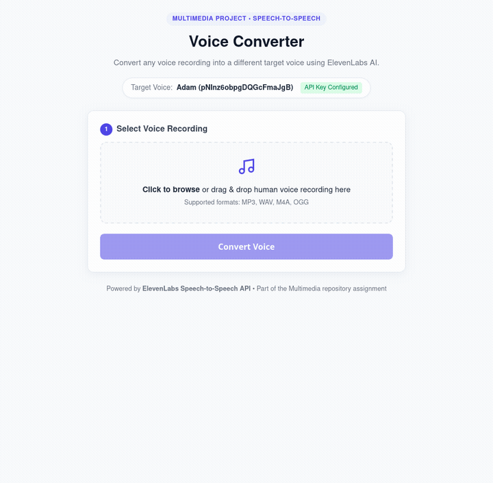

# Voice Converter (ElevenLabs Speech-to-Speech)


A lightweight voice-conversion web application built for the Multimedia assignment. It takes an input voice recording (e.g., MP3 or WAV) and transforms it into a target voice using ElevenLabs' Speech-to-Speech (STS) / Voice Changer API while preserving the rhythm, pitch inflection, and pacing of the original speaker.

## Demo Video & Preview



🎬 **[Click to watch / download the full demo video with human voice audio (demo.mp4)](demo.mp4)**
*(Features a human female voice saying "I am female, I am speaking English..." converted into Adam's deep masculine voice).*

---

## 1. What the Project Does

- **Voice Transformation:** Takes any speaker's voice recording and replaces the vocal timbre and tone with a distinct target speaker (default: ElevenLabs **Adam** voice).
- **Secure Architecture:** The backend securely communicates with ElevenLabs using an API key stored in `.env`, ensuring the secret key is never exposed to the browser.
- **Immediate Playback & Download:** Lets users listen to the converted audio directly in their browser and download the resulting MP3 file.

---

## 2. Technologies Used

- **Frontend:**
  - Plain HTML5 (semantic layout & file upload)
  - Plain CSS3 (clean, responsive card design)
  - Plain JavaScript (vanilla Fetch API & HTML5 Audio)
- **Backend:**
  - **Node.js** & **Express** (minimal, lightweight HTTP server)
  - **Multer** (handles multipart audio file uploads in memory)
  - **dotenv** (environment variable management for `.env`)
- **External AI API:**
  - **ElevenLabs Speech-to-Speech API** (`/v1/speech-to-speech/{voice_id}`) with the `eleven_multilingual_sts_v2` model.

---

## 3. How to Add the ElevenLabs API Key

1. Copy the example environment file into a real `.env` file inside the `voice-converter` directory:
   ```bash
   cp .env.example .env
   ```

2. Open `.env` and add your ElevenLabs API key:
   ```env
   ELEVENLABS_API_KEY=your_actual_elevenlabs_api_key_here
   ```

   *(You can obtain a free API key by signing up at [elevenlabs.io](https://elevenlabs.io) &rarr; Click your profile icon in the bottom-left &rarr; **API Keys**).*

3. *(Optional)* You can change the target voice by changing `TARGET_VOICE_ID` in `.env`:
   - **Adam (Deep American Male):** `pNInz6obpgDQGcFmaJgB` *(Default)*
   - **Rachel (Calm American Female):** `21m00Tcm4TlvDq8ikWAM`
   - **Antoni (Friendly American Male):** `ErXwobaYiN019PkySvjV`

---

## 4. How to Run the Project

1. Navigate into the `voice-converter` directory:
   ```bash
   cd voice-converter
   ```

2. Install dependencies (if not already installed):
   ```bash
   npm install
   ```

3. Start the application:
   ```bash
   npm start
   ```

4. Open your browser and navigate to:
   ```
   http://localhost:3000
   ```

---

## 5. How the Voice Conversion Works

1. **Upload:** The user selects an audio file in the browser (`.mp3`, `.wav`, etc.).
2. **Forwarding to Backend:** The browser sends the audio file to the Express server endpoint (`POST /api/convert`).
3. **ElevenLabs STS API Call:**
   - The server packages the audio into a multipart request.
   - It attaches the private `xi-api-key` header and calls:
     ```
     POST https://api.elevenlabs.io/v1/speech-to-speech/{TARGET_VOICE_ID}
     ```
   - The ElevenLabs model (`eleven_multilingual_sts_v2`) analyzes the acoustic characteristics (pitch, inflection, phrasing, timing) of the input voice and re-synthesizes the words using the vocal traits of the target voice.
4. **Streaming to Client:** The backend receives the converted audio stream (`audio/mpeg`) from ElevenLabs and pipes it back to the client.
5. **Playback & Download:** The browser creates an object URL from the received audio blob, plays it in the `<audio>` player, and makes it available for one-click download.

---

## 6. Project Structure

```
voice-converter/
├── .env.example      # Template for environment variables
├── .gitignore         # Ignores node_modules and .env
├── package.json       # Node.js project manifest & dependencies
├── server.js          # Express server & ElevenLabs API proxy
├── README.md          # Project documentation
└── public/            # Static frontend files
    ├── index.html     # User interface
    ├── style.css      # Styling
    └── app.js         # Audio upload, playback, and API handling
```
